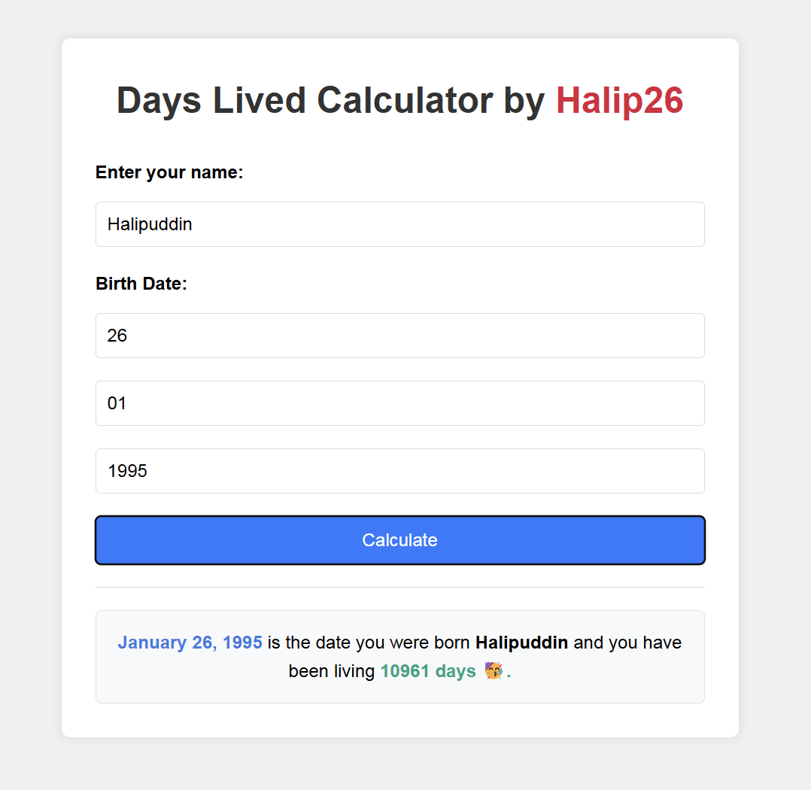

# Days Lived Calculator

Calculate the exact number of days you've been alive. Discover your life duration in days with our easy-to-use calculator.

## Table of Contents

- [Days Lived Calculator](#days-lived-calculator)
  - [Table of Contents](#table-of-contents)
  - [Description](#description)
  - [Preview](#preview)
  - [Features](#features)
  - [Installation](#installation)
  - [Usage](#usage)
  - [License](#license)

## Description

The Days Lived Calculator allows users to input their birth date and name to calculate the total number of days they have been alive. The result is displayed with a smooth animation and includes the formatted birth date and the total days lived.

## Preview



## Features

- Input fields for name and birth date (day, month, year)
- Local storage to save user inputs
- Responsive design
- Smooth animations for result display

## Installation

Clone the repository and open the `index.html` file in your browser.

```sh
git clone https://github.com/Halip26/days-lived-calculator.git
cd days-lived-calculator
open index.html
```

## Usage

  1. Enter your name in the provided input field.
  2. Enter your birth date (day, month, year).
  3. Click the "Calculate" button to see the result.

## License

This project is licensed under the MIT License. See the [LICENSE](LICENSE) file for details.
